Husky Dual UR5 Mobile Manipulation Demo (Simulation) 
=================================================   

Introduction
----------------

.. Note:: This tutorial assumes you have ROS Indigo installed, Gazebo, RViz, and a computer that is strong enough to handle simulations and inverse kinematics. If you wish to work with the real Clearpath Robotics Dual UR5 Husky, please see www.clearpathrobotics.com.

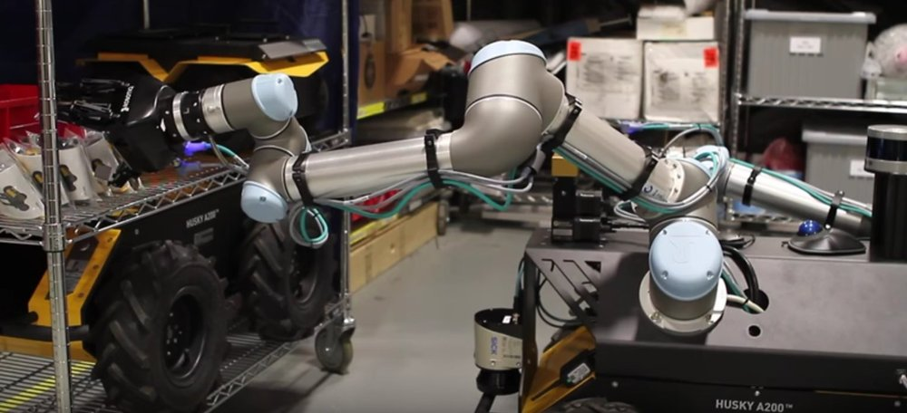

The Husky dual UR5 is an out of the box solution to dual arm mobile manipulation! It comes installed with all associated ROS drivers, as well as a MoveIT! configuration for both arms. We're also able to add whatever sensors you may require for your research needs!

Installation
-------------------

On a real platform purchased from Clearpath Robotics AND in Simulation

If you have the Dual UR5 integration setup from Clearpath Robotics, you may use this tutorial to revert your Husky's workspace back to a working state. This tutorial can also be used to run the simulator of this platform without purchase.

All of the packages used in this demo can be found at https://github.com/DualUR5Husky

.. code:: bash

        mkdir -p ~/dual_ws/src
        cd ~/dual_ws/src && catkin_init_workspace
        git clone https://github.com/DualUR5Husky/husky
        git clone https://github.com/DualUR5Husky/ur_modern_driver
        git clone https://github.com/DualUR5Husky/universal_robot
        git clone https://github.com/DualUR5Husky/robotiq
        git clone https://github.com/DualUR5Husky/husky_simulator
        cd ..

.. code:: bash

        source /opt/ros/indigo/setup.bash
        catkin_make install

.. code:: bash
	
        ~/.bashrc << "source ~/dual_ws/devel/setup.bash"

If there are outstanding dependencies, please use rosdep or apt-get to resolve them.

.. code:: bash

        sudo apt-get update

        rosdep install --from-paths src --ignore-src --rosdistro=indigo -y

Usage:
---------------------------------

The dual UR5 Husky is easy to start working with! All the packages you'll need are conveniently located in one place, and there's no need to worry about setting parameters or customer configuration. Just follow the steps below to bring up the robot's simulation environment, afterwards, we'll get into how to move your new robot!

.. code:: bash

	roslaunch husky_gazebo husky_empty_world.launch

The terminal screen should report no errors and look like this:

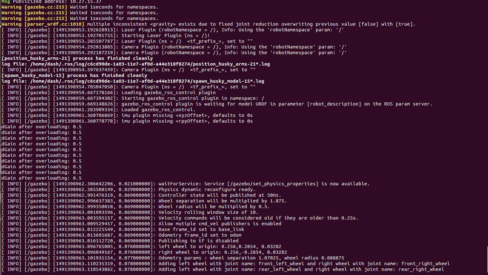

Gazebo should pop up now. The arms will go through some movement behaviours to rest them back at their home position, and then the robot should look like this:

.. image:: huskydualimgs/Selection_192.png

To launch the interact with the robot within Rviz:

.. code:: bash

        roslaunch husky_dual_ur5_moveit_config demo.launch

and the Rviz screen will appear:

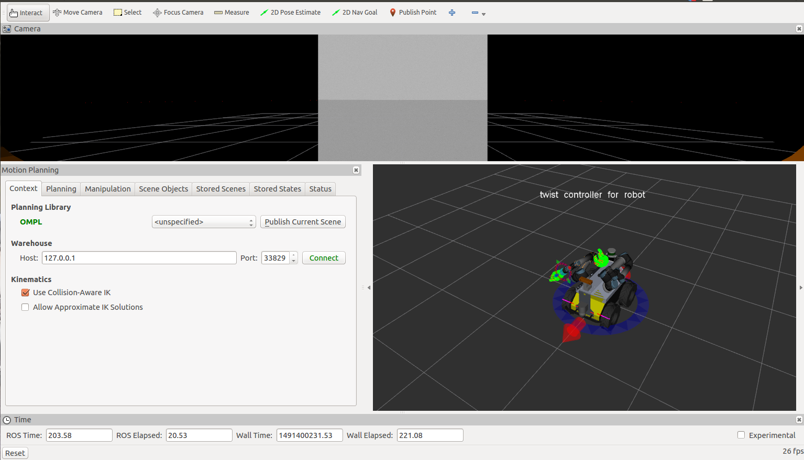

This custom rviz configuration has three views by default. The top most view is the camera feed coming from the bumblebee with respect to the robots frame. The bottom left view is the MoveIt! planning plugin pipeline. The one in the bottom right is the visualization of the robot state. Dragging the orbs around the arm will allow you to position the arm any way you want.

Try dragging the arm around:

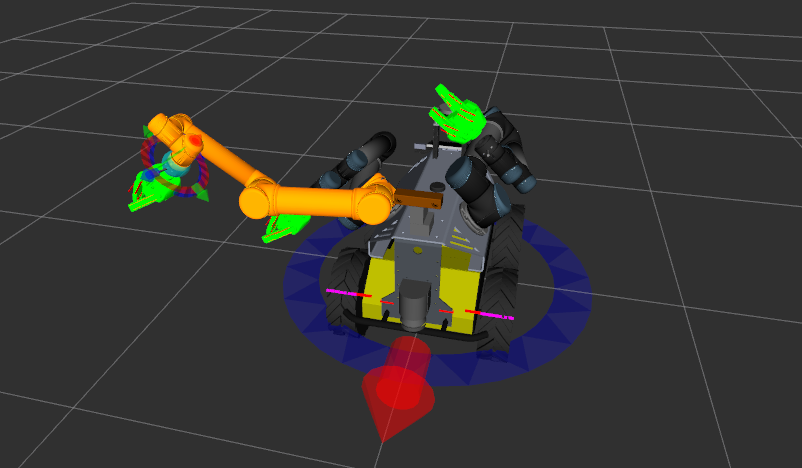

To get the arm to finally plan and execute its position in Gazebo, use the motion planning plugin:

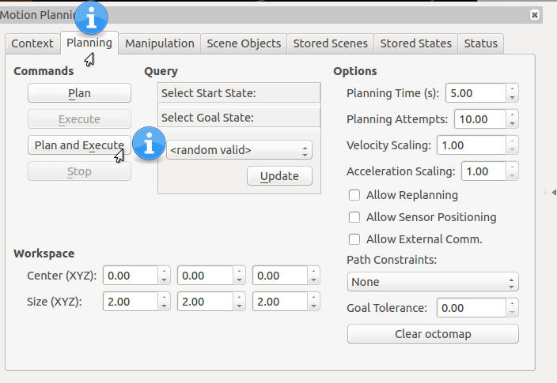

The arm should be fully extended in Gazebo (or to wherever you specified to move it)

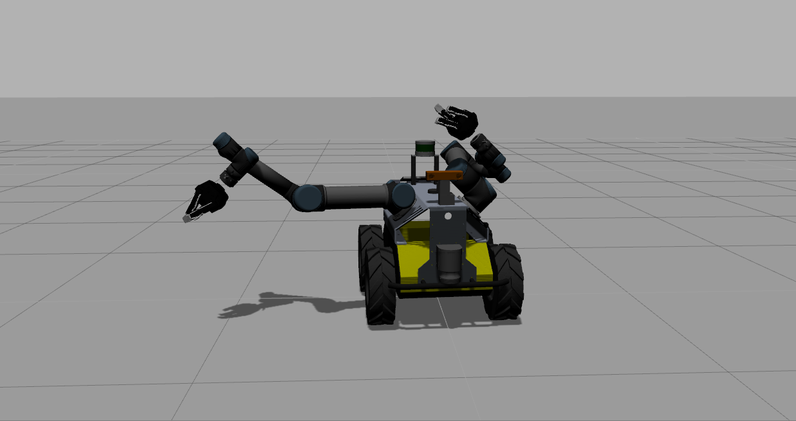

To move the other arm, open up the planning window to change the "Planning Request" name. Go to Rviz's top menu bar and find "Panels" and then select "Displays" which will open another window in the Rviz screen:

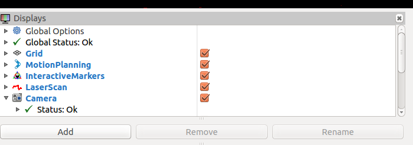

Click on "MotionPlanning" and expand it down and find the "Planning Request" drop down. Change it to "left_arm" and notice the orb moves to the left arm so you can position that.

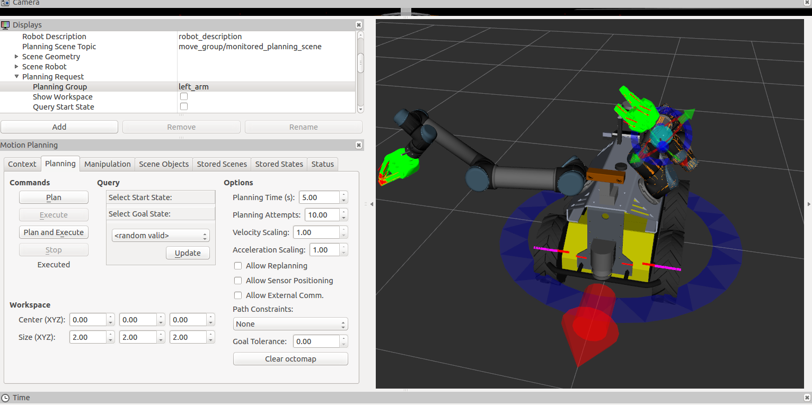

Clicking "plan and execute" also works once you move it, you will see it move in Gazebo. Note sometimes it *may* fail, you will just have to plan and execute again if it doesn't find a path the first time.

The final position of the arms in Gazebo after execution:

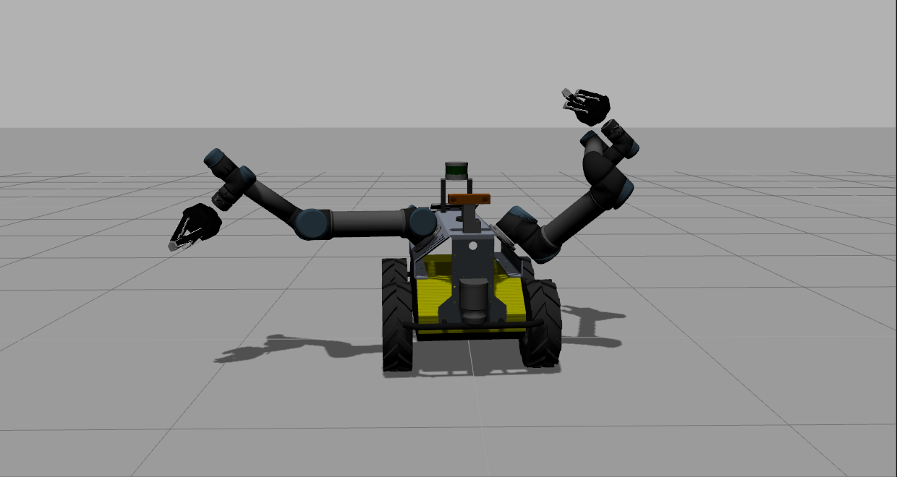

Controlling The Grippers
---------------------------------------------------------

The grippers are controlled (from an end user perspective), by a neat little script made by Robotiq. Run this command to bring up the gripper controller. Change topic:= to either /left_hand/ or /right_hand/ depending on which gripper you want to move.

.. code:: bash

       rosrun robotiq_s_model_control SModelSimpleController.py _topic:=/left_hand/command

An interactive command line should come up:

.. image:: huskydualimgs/Selection_200.png

typing "a" will activate it, and then "o" will open it. It should look like this:

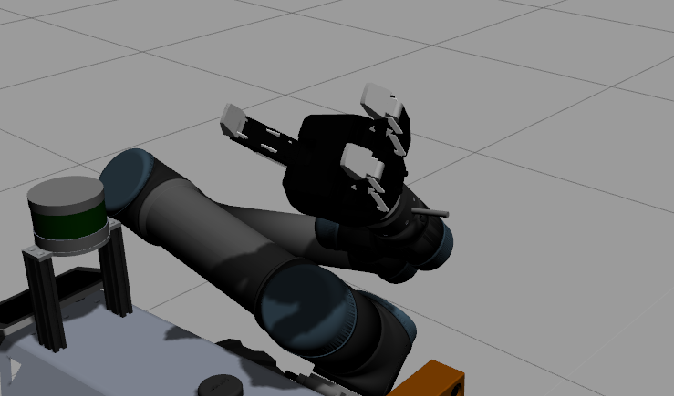

typing "p" will pinch it close like so

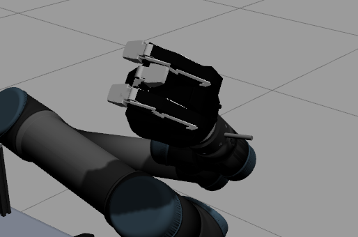

Navigation And Mapping with the Dual UR5 Husky
--------------------------------------------------

Start the husky gazebo from scratch using the playpen so there will be objects:

.. code:: bash

         roslaunch husky_gazebo husky_playpen.launch

Bring up the mapping demo:

.. code:: bash

         roslaunch husky_navigation gmapping_demo.launch

Bring up the visualization for it:

.. code:: bash

         roslaunch husky_viz view_robot.launch

Now, you will be able to map, navigate, and control the robot. Use the interactive markers to drive it around. Please see these pictures for instructions:

Spawning in playpen:

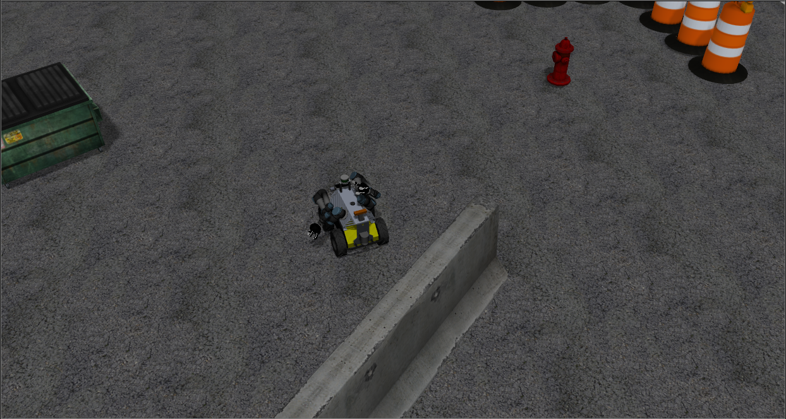

When the Rviz starts, make sure you turn navigation on by clicking in the display window, should look like this:

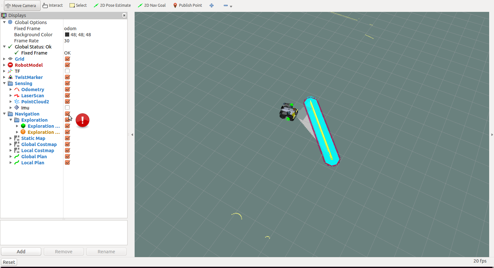

Move it around and it will build its map (using the interactive markers)

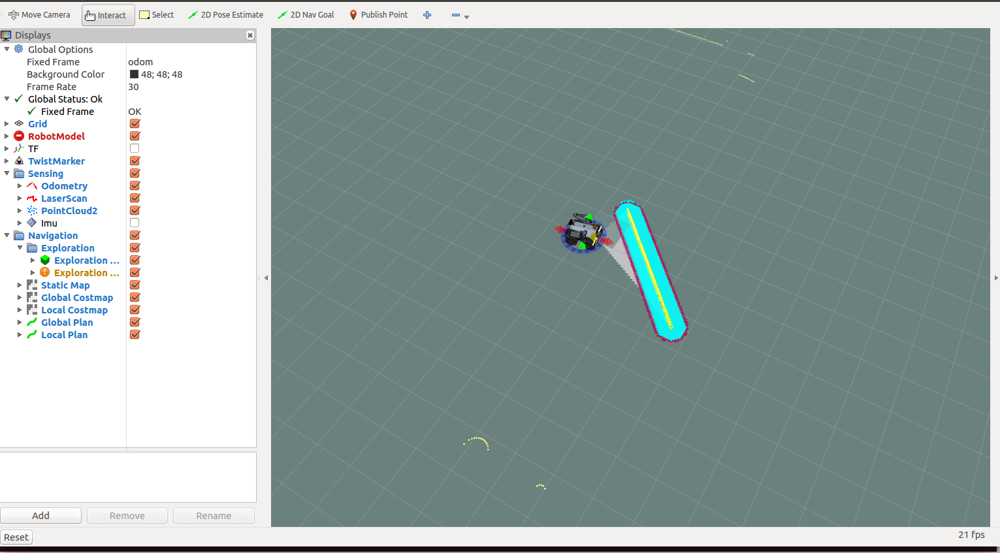

Use 2D Nav Goal to select points on the map for your Husky to navigate to!

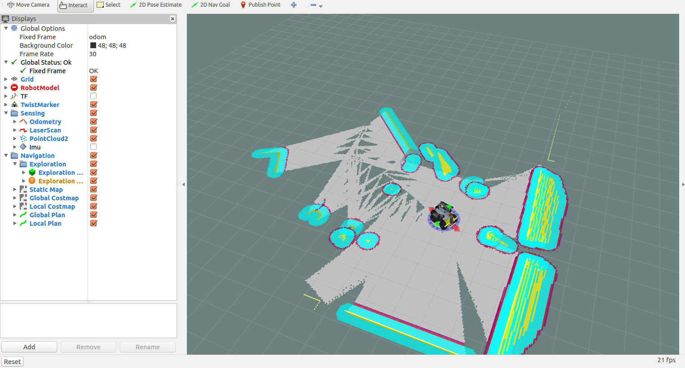

Related links
https://www.youtube.com/watch?v=vymJBbnz6bQ - A demonstration by Clearpath Robotics
http://www.bbc.com/news/uk-scotland-39330441 - Featured by BBC UK article

