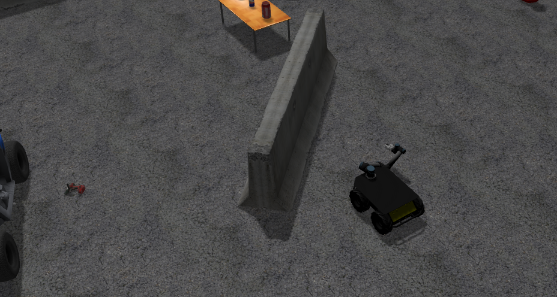
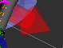
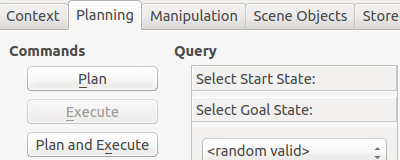
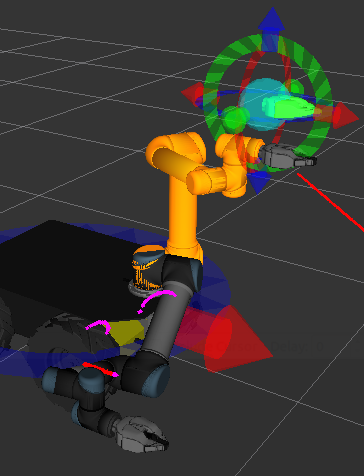
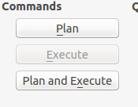
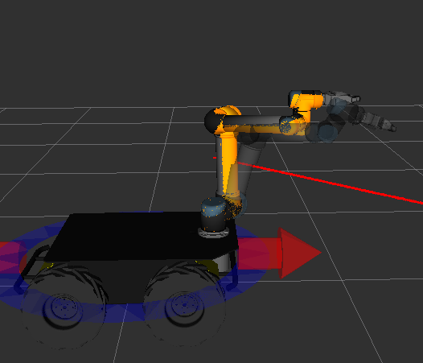
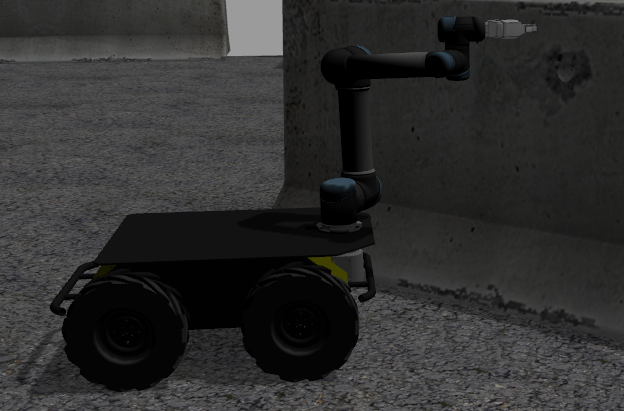

Husky UR5 Mobile Manipulation Demo (Simulation)
=================================================   

Introduction
----------------

.. Note:: This tutorial assumes you have ROS Indigo installed, Gazebo, RViz, and a computer that is strong enough to handle simulations and inverse kinematics. If you wish to work with the real Clearpath Robotics Husky UR5, please see www.clearpathrobotics.com.

.. image:: Selection_016.png

The Husky UR5 mobile manipulation tutorial will show you how to operate a mobile manipulation robot using Gazebo, RViz, `MoveIt <http://wiki.ros.org/MoveIt>`_, and the UR5 arm. There will be full control and actuation of the robot, and the software written for this robot can be easily translated into real world actions with the real Husky UR5 robot by Clearpath Robotics.

Installation
-------------------

Make sure you have the husky_simulator packages and husky_ur5_moveit_config packages installed.This tutorial also assumes you have ROS, Gazebo, and RViz installed on your system.

.. code:: bash

	sudo apt-get install ros-indigo-husky-simulator && sudo apt-get install ros-indigo-husky-ur5-moveit-config

If users wish to use the free-planning mode vs joint-limited mode (As of April 1st the universal_robot package used to plan hasn't been updated in debs and so source must be used), please install the source package for universal_robot and use it to ovveride the deb installed.

In addition, make sure you have the most updated packages of ros_control & universal_robot debs on your machine. (If you get an error about the hardwareInterface and joints being missing, you will need to change your control_ur5.yaml file inside husky_control. Please download the husky source package. This was broken and fixed as of May 16, 2015 but still hasn't been released to the public Indigo debs.)

.. code:: bash
	
	mkdir -p devel_ws/src && cd devel_ws/src && catkin_init_workspace

.. code:: bash

	git clone https://github.com/ros-industrial/universal_robot && cd ..

.. code:: bash

	catkin_make install

Before running each command in this tutorial, run this command or add it to your ~/.bashrc file:

.. code:: bash

	source ~/devel_ws/devel/setup.bash

Bring up Gazebo And The Husky
---------------------------------

Running the launch file which will bring up Gazebo with the Husky + UR5.

.. code:: bash

	roslaunch husky_gazebo husky_playpen.launch ur5_enabled:=true

which will look like this: (note the gripper release hasn't been pushed into debs so it will not have the gripper)

Stow the arm to home position
-----------------------------------

If the arm spawns out in front, likely the stow was disabled for safety reasons. Run the stow script to home the arm, which will move it in the Gazebo simulation.

.. code:: bash

	rosrun husky_control stow_ur5

Bring Up MoveIt & RViz
-----------------------------

To do so:

.. code:: bash

	roslaunch husky_ur5_moveit_config husky_ur5_planning_execution.launch sim:=true

.. code:: bash

	roslaunch husky_ur5_moveit_config moveit_rviz.launch config:=true

Which will bring up a screen that has the Husky like this:

.. image:: spawnedbot.png

Moving The Husky
-------------------

Bring up the interactive marker server:

.. code:: bash

	rosrun interactive_marker_twist_server marker_server

And make sure to add the interactive marker plugin to RViz by clicking "Add" and then finding interactive markers. Be sure to set the topic to the correct one as well, or else you won't be able to move the Husky base around with them.

Interfacing with the robot is super simple! See the markers in the scene? Just click on them to move the robot around. The blue marker will control its turning.

.. image:: bluegrabber.png

And the red marker will control its forward and backward motion.

Moving The Husky's Arm
--------------------------

After playing with the Husky's movement capabilities, now we can look at how to move its arm. On the left hand side of RViz, you will see a panel that looks like this. Make sure "Planning" is selected.

Now click and drag the end effector in RViz which will highlight when your mouse is over it:

.. image:: gripperorb.png

There's a lot going on in this next picture. I will explain. The orange arm is the goal position for the arm. Dragging the orb allows you to move the end effector to its desired position. A kinematic solver will move the orange arm around to satisfy the constraint of where you put the orb. The markers near the orb will allow you to precisely precision the orb to wherever you want it. The proper coloured arm is where the arm is currently positioned in the real world (but in this case, Gazebo simulation).

Now, in the planning tab, press plan and execute. This will plan a path for the arm to take to move it to the orange goal state. Execute will interact with the controllers on the robot to move it to that position.

Notice that the arm , after I had pressed plan and execute, has moved in simulation and in the visualization software.

