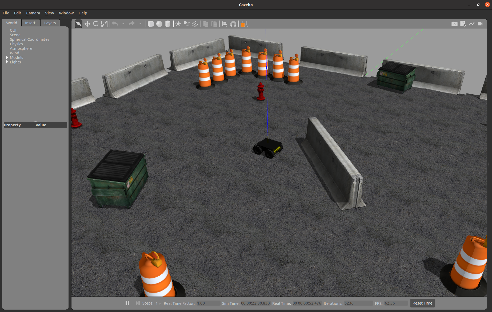

Simulating Husky
=================

Whether you actually have a physical Husky robot or not, the Husky simulator is a great way to get started with ROS2 robot development. In this tutorial, we will go through the basics of starting Gazebo and Rviz and how to drive your Husky around.

Launch Gazebo
--------------

Gazebo is a common simulation tool used in ROS2. Husky's model in Gazebo include reasonable
approximations of its dynamics, including wheel slippage, skidding, and inertia. To launch a simulated Husky in a simple example world, run the following command:

.. code-block:: bash

    ros2 launch husky_gazebo husky_playpen.launch.py

You should see the following window appear, or something like it. You can adjust the camera angle by clicking and dragging while holding CTRL, ALT, or the shift key:

The window which you are looking at is the Gazebo Client. This window shows you the "true" state of the simulated world which the robot exists in. It communicates on the backend with the Gazebo Server, which is doing the heavy lifting of actually maintaining the simulated world. At the moment, you are running both the client and server locally on your own machine, but some advanced users may choose to run heavy duty simulations on separate hardware and connect to them over the network.

Launch rviz
-----------

The next tool we will encounter is rviz. Although superficially similar in appearance to Gazebo,
rviz has a very different purpose— unlike Gazebo, which shows the reality of the simulated world, rviz shows the robot's *perception* of its world, whether real or simulated. So while Gazebo won't be used with your real Husky, rviz is used with both.

.. Note::

  If you are working with a simulated robot you should leave Gazebo running and open a new terminal to launch rviz. If you installed the Husky simulation packages from source, make sure to run ``source devel/setup.bash`` in the workspace where the packages are installed when opening the new terminal.

You can using the following launch invocation to start rviz with a pre-cooked configuration suitable for visualizing any standard Husky config:

.. code-block:: bash

    ros2 launch husky_viz view_robot.launch.py

You should see rviz appear:

.. image:: images/husky_rviz.png

