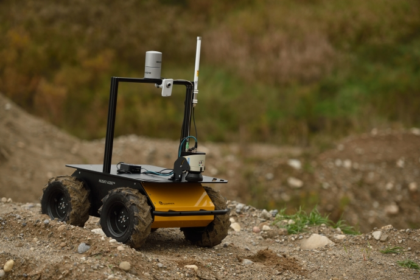

Husky UGV Tutorials 
=====================         

    

Husky is a rugged, outdoor-ready unmanned ground vehicle (UGV), suitable for research and rapid prototyping applications. Husky fully supports ROS—all of the packages are available in the `Husky github org <https://github.com/husky>`_.

For more information or to receive a quote, please `visit us online <http://clearpathrobotics.com/husky>`_.

.. Warning:: These tutorials assume that you are comfortable with ROS and the catkin build system.  Please familiarize yourself using the `ROS <http://wiki.ros.org/ROS/Tutorials>`_ and `catkin <http://wiki.ros.org/catkin/Tutorials>`_ tutorials. 
 
.. toctree::
    :maxdepth: 0
    :caption: Installation

    BackUpHusky.rst
    InstallHuskySoftware.rst
    CustomizeHuskyConfig.rst

.. toctree::
    :maxdepth: 0
    :caption: Using Husky

    SimulatingHusky.rst
    InterfacingWithHusky.rst

.. toctree::
    :maxdepth: 0
    :caption: Demo Applications: Navigation

    HuskyMove.rst
    HuskyAMCL.rst
    HuskyGmapping.rst
    HuskyFrontiers.rst

.. toctree::
    :maxdepth: 0
    :caption: Demo Applications: Manipulation

    HuskyManip.rst
    HuskyDualManip.rst

.. toctree::
    :maxdepth: 0
    :caption: Package Components

    HuskyPackages.rst

